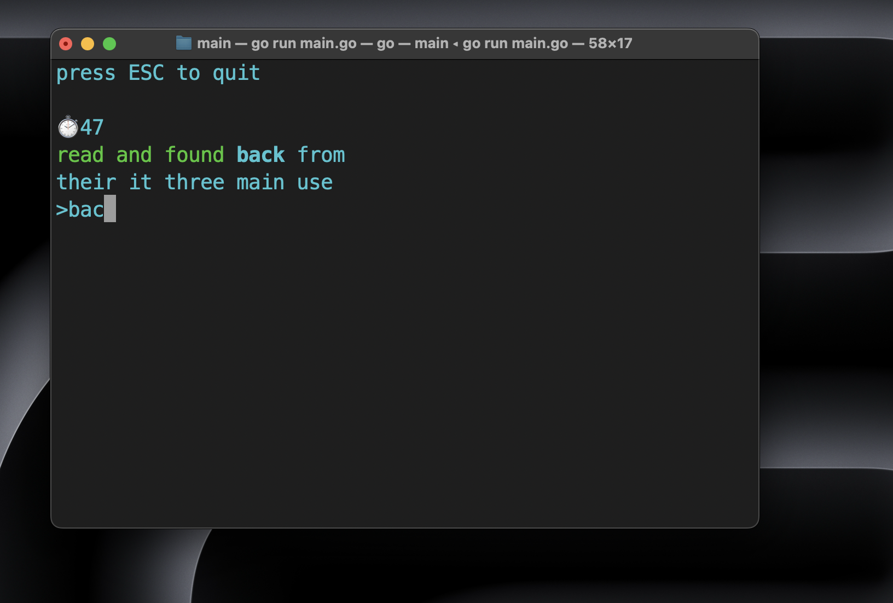

<h1>Terminal Typing Test</h1>

Train your typing speed in terminal!



<h1>Installation</h1>

yet only mackOS!!

<h2>MacOS<h2>
<h3>1. copy bash and execute script:</h3>
macOS:

```
curl -fsSL https://raw.githubusercontent.com/hodzzzinsky/ttt_download/main/ttt_installer.sh | bash -s ttt_installer.sh
```

<h3>2. update .bashrc or .zshrc config:</h3>

<h5>if you have zsh</h5>

```
source ~/.zshrc
```
<h5>if you have bash</h5> 

```
source ~/.bashrc
```
<h3>3. start program</h3>

type 'ttt' in your terminal to start application

```zsh
ttt
```

<h3>Source code</h3>

[link to source code](https://github.com/hodzzzinsky/terminal_typing_test)
